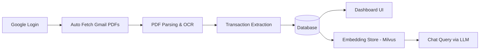

# MoneyView.AI

MoneyView.AI is a personal finance platform that automatically fetches bank and credit card statements, processes them, and provides an AI chatbot for financial insights.

* Built with Next.js + FastAPI, integrates LLaMA & Qwen for AI Q&A.
* Auto-fetches & unlocks bank/credit card statements, processes via OCR, shows dues & spends on UI.
* Chatbot: PDFs → chunks → Milvus vector DB → embeddings → AI answers.
* Infra: Docker + K8s (replicas), HAProxy, Kong Gateway, Load Balancer for scaling & rate limiting.
* Monitoring: Opentelemetry for end to end API tracing, Prometheus & Grafana for Infra Monitoring, Langsmith for LLM Monitoring

---

## Demo

### Secure Authentication

Users sign in using Google Authentication, ensuring a secure and frictionless onboarding experience.

### Automatic Statement Ingestion

After login, the platform automatically retrieves financial statements from Gmail attachments. It supports:

* Bank and credit card statements fetched directly from email
* Password-protected PDFs unlocked using common password patterns
* OCR-based extraction for scanned or image-based documents

<p align="center">
  
</p>

---

## Dashboard

The dashboard provides a clear, consolidated view of a user’s financial health.

It displays:

* Current balances and outstanding dues
* Upcoming payment deadlines and minimum amounts due
* Categorized spending insights such as shopping, fuel, and utilities

All information is derived automatically from uploaded or fetched statements, requiring no manual input.

<p align="center">
  
</p>

---

## AI-Powered Financial Chatbot

The platform includes an intelligent chatbot that allows users to query their financial data in natural language.

### How it works

* PDF statements are split into meaningful text chunks
* Each chunk is converted into embeddings
* Embeddings are stored in a Milvus vector database
* User queries are embedded and matched against relevant chunks
* Context is passed to an LLM (LLaMA or Qwen) to generate accurate, grounded responses

### Example Queries

**Question:** What is my IndianOil HDFC Bank total due, minimum due, and due date for this month?

The system retrieves the relevant statement sections and responds with exact figures and supporting context.

<p align="center">
  
</p>

---

**Question:** What is the minimum amount I have to pay this month?

<p align="center">
  
</p>

---

**Question:** How much did I spend on Flipkart shopping this month?

<p align="center">
  
</p>

---

This approach allows users to understand and manage their finances through simple questions, eliminating the need to manually review statements or track expenses in spreadsheets.


---

## 🚀 Overview

This platform automates manual effort involved in tracking expenses, EMIs, dues, and monthly spending.

### Key Highlights:

* Secure login using **Google Authentication**
* Auto-fetches **bank & credit card statements** directly from Gmail
* Unlocks password-protected statements automatically
* Extracts transactional data using **OCR + PDF parsing**
* Visual dashboard with categorized insights
* Ask anything about your finances using an **AI chatbot**

---

## 🔐 Authentication & Access

* Users authenticate securely via Google Sign-In
* Read-only Gmail access for attachments
* No manual uploads required

---

## 📥 Auto Statement Fetching

The system automatically:

1. Reads Gmail inbox for monthly statements (HDFC, SBI, ICICI, Axis, etc.)
2. Detects credit card & bank PDFs
3. Unlocks password-protected PDFs using common patterns
   (e.g., date of birth, registered mobile number)
4. Extracts financial data using:

   * PDF parsing
   * OCR (for scanned statements)

All extracted records are normalized into a unified schema.

---

## 🧠 AI Chat Support

Users can chat with their financial data naturally.

### How it works:

```
PDF → Split into Chunks → Generate Embeddings → Store → Query → LLM
```

🔧 Pipeline:

| Step       | Task                                    |
| ---------- | --------------------------------------- |
| Chunking   | Split statements into meaningful chunks |
| Embeddings | Convert chunks to vectors               |
| Storage    | Milvus Vector DB                        |
| Serving    | LLaMA/Qwen based LLM                    |

### Example Queries:

> ❓ *What is the minimum amount I have to pay this month?*
> ❓ *How much did I spend on Flipkart shopping this month?*
> ❓ *What is my IndianOil HDFC Card due amount and due date?*

The chatbot scans relevant financial context and returns precise answers.

---

## 📊 Dashboard Features

Once statements are processed, dashboard offers:

### 👇 You can see:

* Current outstanding across cards
* Minimum due amounts
* Upcoming due dates
* EMI breakdown
* Month-wise category expenditure analytics

---

## 🏗️ Tech Stack

| Area            | Technologies Used                  |
| --------------- | ---------------------------------- |
| Authentication  | Google OAuth                       |
| Backend         | Python, FastAPI                    |
| Data Extraction | PDFPlumber, PyMuPDF, Tesseract OCR |
| Vector DB       | Milvus                             |
| AI Model        | LLaMA / Qwen                       |
| ORM             | SQLAlchemy                         |
| DB              | PostgreSQL                         |
| Frontend        | React / Tailwind                   |
| Deployment      | Docker                             |

---

## 🔄 Data Workflow



---

## 🎯 Use Cases

✔ Track monthly expenses automatically
✔ Know your EMIs and dues instantly
✔ Identify unwanted subscriptions
✔ Chat like a financial advisor

---

## 🚧 Future Enhancements

* UPI/POS SMS parsing
* Multi-bank category prediction using ML
* Push reminders before due dates
* Export analytics reports as PDF

---

## 🏁 Summary

This platform eliminates manual tracking by combining automation + OCR + AI + conversational analytics.
It moves beyond static financial dashboards and allows users to **interact with their financial life using natural language**.
