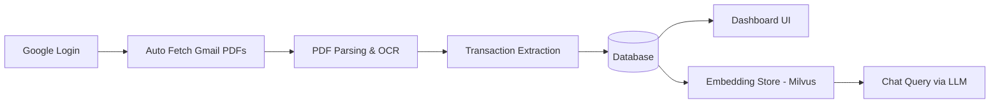

# MoneyView.AI

MoneyView.AI is a personal finance platform that automatically fetches bank and credit card statements, processes them, and provides an AI chatbot for financial insights.

* Built with Next.js + FastAPI, integrates LLaMA & Qwen for AI Q&A.
* Auto-fetches & unlocks bank/credit card statements, processes via OCR, shows dues & spends on UI.
* Chatbot: PDFs → chunks → Milvus vector DB → embeddings → AI answers.
* Infra: Docker + K8s (replicas), HAProxy, Kong Gateway, Load Balancer for scaling & rate limiting.
* Monitoring: Opentelemetry for end to end API tracing, Prometheus & Grafana for Infra Monitoring, Langsmith for LLM Monitoring

  


---

## 🚀 DEMO

### 🔐 Secure Login

Users log in seamlessly using **Google Authentication**, ensuring secure and trusted access.

### 📩 Automatic Statement Fetching

Once logged in, the platform automatically:

* Fetches **bank & credit card statements** directly from **Gmail attachments**
* Detects and **unlocks password-protected PDFs** using common password patterns
* Applies **OCR** to extract structured financial data from scanned or image-based PDFs


---

## 📊 Dashboard

A unified financial overview that gives users instant clarity on their money.

### Key Highlights:

* 💰 **Total account balance & outstanding dues**
* 📅 **Upcoming due dates & minimum payments**
* 🧾 **Categorized spending insights** (shopping, fuel, utilities, etc.)
* 🔄 Data auto-refreshes from uploaded or fetched statements


---

## 🤖 AI-Powered Financial Chatbot

Interact with your financial data using **natural language queries**.

### 🔧 How it works:

1. 📄 **PDF statements** are split into semantic chunks
2. 🧠 Chunks are converted into **embeddings**
3. 📦 Stored in **Milvus Vector Database**
4. 🔍 User query → embedding search →
5. 🤖 Context passed to **LLMs (LLaMA / Qwen)** → precise, grounded response

### 🗣️ Example Questions You Can Ask:

> **“What is my IndianOil HDFC Bank total due, minimum due, and due date for this month?”**
> → Answers directly from your statement with exact figures and context


---

> **Query:** *What is the minimum amount I have to pay this month?*


---

> **Query:** *How much did I spend on Flipkart shopping this month?*


---

✨ **Result:** A clean, intelligent, and conversational way to understand your finances — no manual tracking, no spreadsheets, just answers.


---

## 🚀 Overview

This platform automates manual effort involved in tracking expenses, EMIs, dues, and monthly spending.

### Key Highlights:

* Secure login using **Google Authentication**
* Auto-fetches **bank & credit card statements** directly from Gmail
* Unlocks password-protected statements automatically
* Extracts transactional data using **OCR + PDF parsing**
* Visual dashboard with categorized insights
* Ask anything about your finances using an **AI chatbot**

---

## 🔐 Authentication & Access

* Users authenticate securely via Google Sign-In
* Read-only Gmail access for attachments
* No manual uploads required

---

## 📥 Auto Statement Fetching

The system automatically:

1. Reads Gmail inbox for monthly statements (HDFC, SBI, ICICI, Axis, etc.)
2. Detects credit card & bank PDFs
3. Unlocks password-protected PDFs using common patterns
   (e.g., date of birth, registered mobile number)
4. Extracts financial data using:

   * PDF parsing
   * OCR (for scanned statements)

All extracted records are normalized into a unified schema.

---

## 🧠 AI Chat Support

Users can chat with their financial data naturally.

### How it works:

```
PDF → Split into Chunks → Generate Embeddings → Store → Query → LLM
```

🔧 Pipeline:

| Step       | Task                                    |
| ---------- | --------------------------------------- |
| Chunking   | Split statements into meaningful chunks |
| Embeddings | Convert chunks to vectors               |
| Storage    | Milvus Vector DB                        |
| Serving    | LLaMA/Qwen based LLM                    |

### Example Queries:

> ❓ *What is the minimum amount I have to pay this month?*
> ❓ *How much did I spend on Flipkart shopping this month?*
> ❓ *What is my IndianOil HDFC Card due amount and due date?*

The chatbot scans relevant financial context and returns precise answers.

---

## 📊 Dashboard Features

Once statements are processed, dashboard offers:

### 👇 You can see:

* Current outstanding across cards
* Minimum due amounts
* Upcoming due dates
* EMI breakdown
* Month-wise category expenditure analytics

---

## 🏗️ Tech Stack

| Area            | Technologies Used                  |
| --------------- | ---------------------------------- |
| Authentication  | Google OAuth                       |
| Backend         | Python, FastAPI                    |
| Data Extraction | PDFPlumber, PyMuPDF, Tesseract OCR |
| Vector DB       | Milvus                             |
| AI Model        | LLaMA / Qwen                       |
| ORM             | SQLAlchemy                         |
| DB              | PostgreSQL                         |
| Frontend        | React / Tailwind                   |
| Deployment      | Docker                             |

---

## 🔄 Data Workflow



---

## 🎯 Use Cases

✔ Track monthly expenses automatically
✔ Know your EMIs and dues instantly
✔ Identify unwanted subscriptions
✔ Chat like a financial advisor

---

## 🚧 Future Enhancements

* UPI/POS SMS parsing
* Multi-bank category prediction using ML
* Push reminders before due dates
* Export analytics reports as PDF

---

## 🏁 Summary

This platform eliminates manual tracking by combining automation + OCR + AI + conversational analytics.
It moves beyond static financial dashboards and allows users to **interact with their financial life using natural language**.
